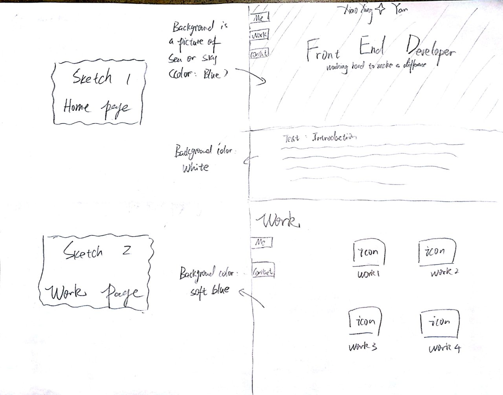
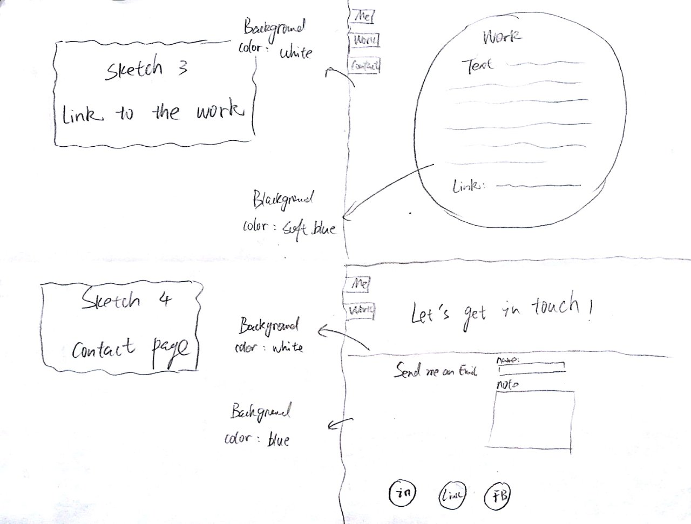
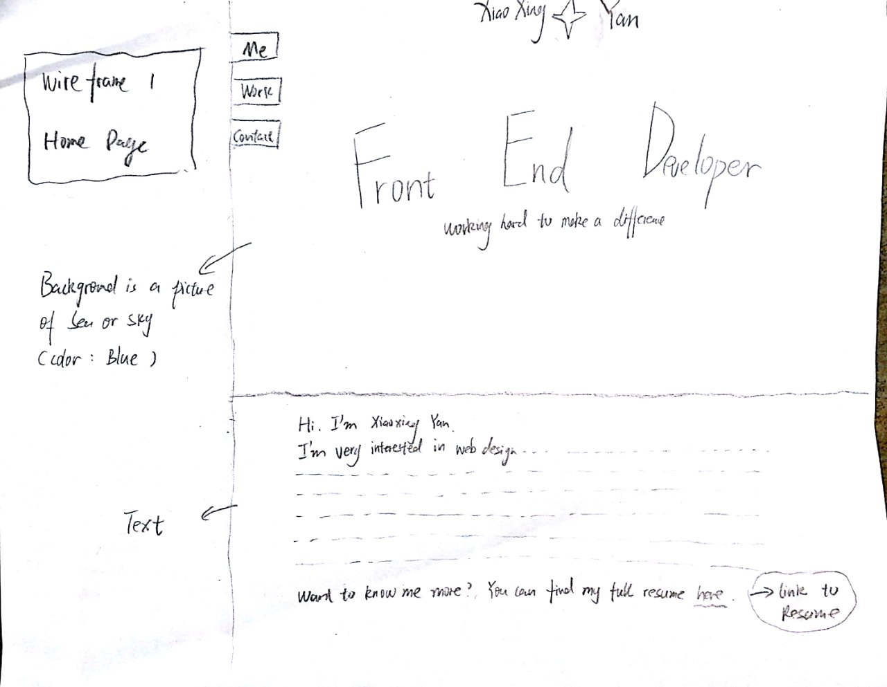
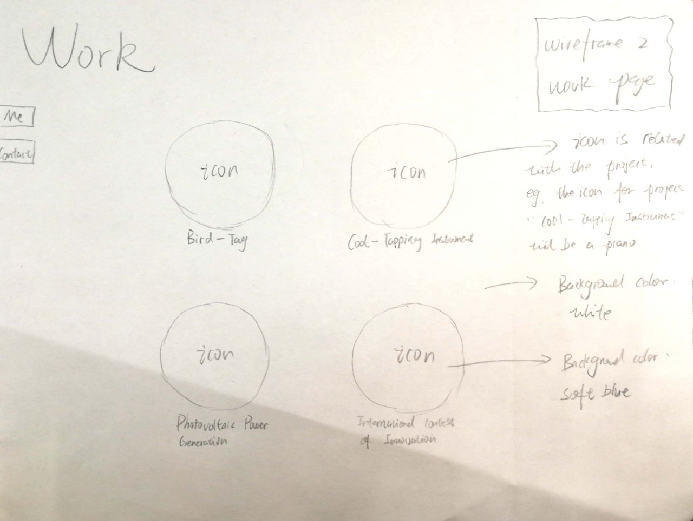
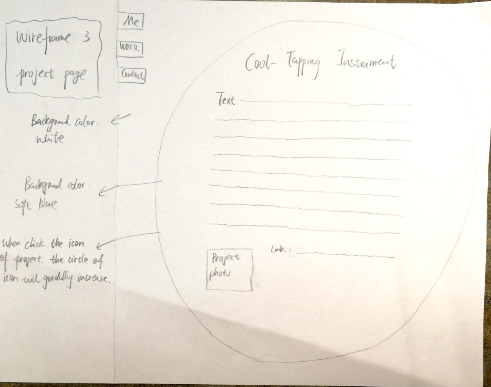
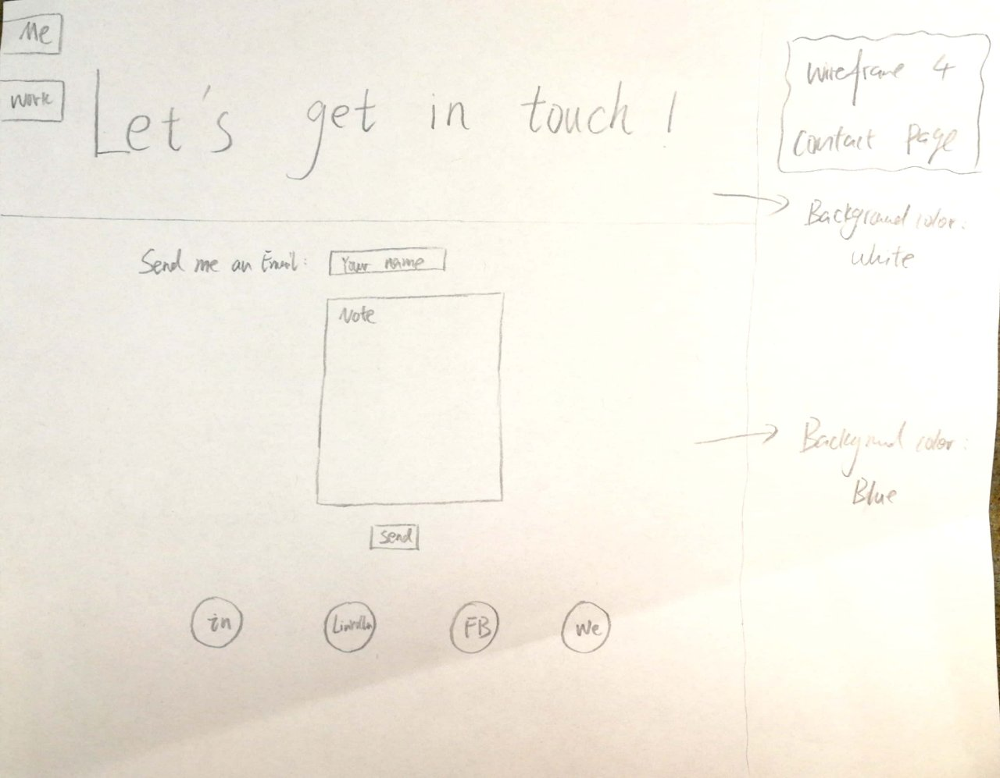

# Project 1, Milestone 1 - Design & Plan

Your Name: Xiaoxing Yan

## 1. Persona

[1. Pick a persona]

I've selected **[Abby]** as my persona.

I've selected my persona because **this persona has been recommanded by you **

## 2. Sketches

**After analyzing the pdf of Abby, I found that a website with the following features can meet her needs:**

* simple -- as she does not have too much time to look through a complicated website

* information - gathering : she used to choose what to do after look through all pages

* with music - she likes music, and set background music may attract her more

* show numbers -- she likes numbers and she is good at thinking with numbers

## 3. Wireframes

In this project, I plan to make a portfolio.

* Home page

I prefer to use an image of sea or sky as background picture.
Under the image, there is an introdution of myself and a link to my resume.

* Work page

Work page is to show all projects I have done before.
When users clik the icon of project, the circle will increase to a larger circle gradually. That is, it changes to detailed project page.

* Project page

Including introduction, pictures and link of my project.

* Contact page

show the way to contact me

## 4. Coding Plan & Pseudocode
(1) Coding plan
* In includes, there will be header.php and init.php.
Header.php is for navigation bar and init.php is for arrays and variables that will be used in all pages.

(2) User defined function
* User defined function 1 — to show text with certain styles
<pre><code>
Create a css id and style it in CSS

 function print_style(text){
           print the text in certain style using predefined CSS id;
}
</code></pre>

* User defined function 2 — In work page, four circles share the same style,
Also, the four icons in contact page also share the same style.
<pre><code>
 function circle_style( icon , text ){
   
              Set the size of circle and background color of circle;
              Set the position of circle;
              Place the icon in the circle;
              Set the link to another page;
              call function print_style(text);

}
</code></pre>
